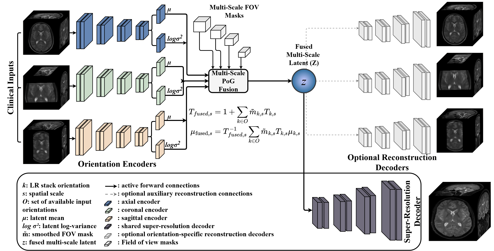
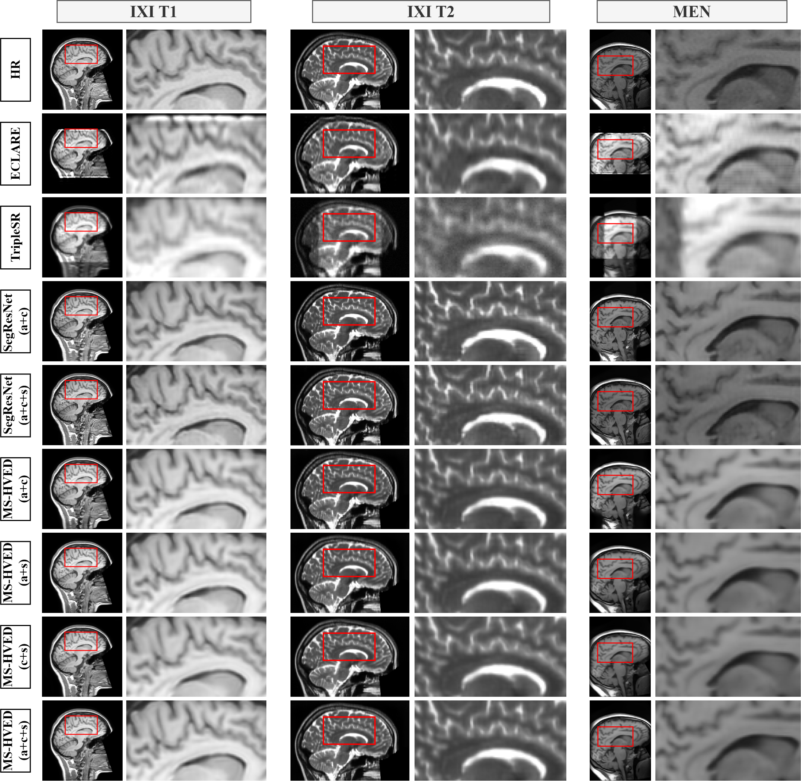

# MS-HVED: Multi-Stack Super-Resolution of Brain MRI Using Hetero-Orientation Variational Encoding

Official implementation of **MS-HVED**, a deep learning framework for isotropic super-resolution of brain MRI from multiple anisotropic orthogonal acquisitions. The model fuses axial, coronal, and sagittal low-resolution stacks via a Product-of-Gaussians posterior to produce high-resolution isotropic outputs.

## Architecture

<p align="center">
  
</p>

## Qualitative Results

<p align="center">
  
</p>

## Requirements

- Python 3.8+
- PyTorch 1.12+
- MONAI
- NiBabel
- NumPy
- (Optional) Weights & Biases for experiment tracking

Install dependencies:
```bash
pip install -r requirements.txt
```

## Pre-trained Models

| Model | Training Data | Link |
|-------|--------------|------|
| MS-HVED (T1) | IXI T1 | [Download](https://example.com/placeholder-ixi-t1-model) |
| MS-HVED (T2) | IXI T2 | [Download](https://example.com/placeholder-ixi-t2-model) |

## Usage

### Training

```bash
python train.py \
  --hr_image_dir /path/to/hr/images \
  --val_image_dir /path/to/val/images \
  --model_dir ./models \
  --epochs 100 \
  --batch_size 2 \
  --learning_rate 1e-4
```

## Orientation Dropout (Handling Missing Views)

MS-HVED can be trained to handle missing orientations, useful for inference when not all views are available.

### Random Dropout

Randomly drops 1-2 orientations during training with specified probability:

```bash
# 50% chance to drop orientations, keep at least 1 view
python train.py \
  --model_dir ./models \
  --orientation_dropout_prob 0.5 \
  --min_orientations 1
```

### Deterministic Dropout

Always drop specific orientations for controlled experiments:

```bash
# Always drop axial view (train with coronal + sagittal only)
python train.py --model_dir ./models --drop_orientations 0

# Always drop axial and coronal (train with sagittal only)
python train.py --model_dir ./models --drop_orientations 0 1

# Orientation indices: 0=Axial, 1=Coronal, 2=Sagittal
```

**Note:** Deterministic and random dropout are mutually exclusive. If both are specified, deterministic takes precedence.

## Ablation Studies

### SR-Only Training (Disable Orientation Reconstruction)

For ablation studies, you can train with all encoders but only the SR decoder, disabling the auxiliary orientation reconstruction task:

```bash
# SR-only training (ablation)
python train.py \
  --model_dir ./models/ablation_sr_only \
  --no_reconstruct_orientations \
  --orientation_weight 0.0 \
  --recon_weight 0.8
```

### Preparing Test Data

Resample input volumes into orthogonal low-resolution stacks:
```bash
python prepare4test.py \
  --input /path/to/input.nii.gz \
  --output_dir /path/to/output
```

### Inference

Run super-resolution on three orthogonal stacks:
```bash
python test.py \
  --input_stacks axial.nii.gz coronal.nii.gz sagittal.nii.gz \
  --model /path/to/checkpoint.pth \
  --output sr_output.nii.gz
```

For batch inference over a directory of subjects:
```bash
python test.py \
  --input_stacks_root /path/to/subjects \
  --model /path/to/checkpoint.pth \
  --output_root /path/to/results
```

### Evaluation

```bash
python evaluate.py \
  --test_dir /path/to/test \
  --prediction_name sr_output.nii.gz \
  --output_csv results.csv
```

## Project Structure

```
├── train.py             # Training script
├── test.py              # Inference script
├── evaluate.py          # Metric computation (PSNR, SSIM, MAE, etc.)
├── prepare4test.py      # Test data preparation
├── src/
│   ├── mshved.py        # MS-HVED model
│   ├── encoder.py       # View-specific encoders
│   ├── decoder.py       # SR and orientation decoders
│   ├── fusion.py        # Product-of-Gaussians fusion
│   ├── losses.py        # Loss functions
│   ├── data.py          # Data loading and augmentation
│   └── utils.py         # Utilities
└── requirements.txt
```

## Acknowledgements

This work uses the [IXI dataset](https://brain-development.org/ixi-dataset/), which is available under a CC BY-SA 3.0 license.

## Citation

If you use this code in your research, please cite:

```bibtex
@article{mshved2025,
  title     = {},
  author    = {},
  journal   = {},
  year      = {2025}
}
```

## License

<!-- Add license information here -->
